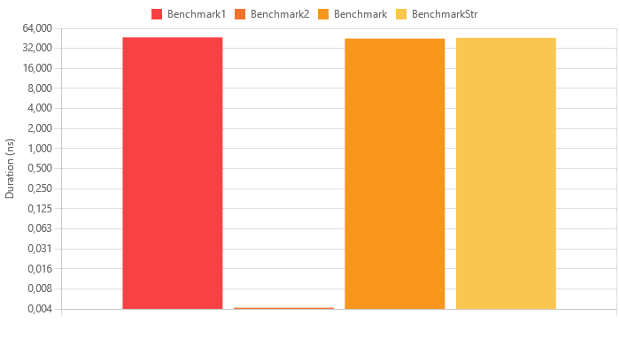

Необходимо написать библиотеку, в которой будет один метод, который по трем сторонам треугольника будет определять, является треугольник остроугольным, прямоугольным или тупоугольным. 
Метод должен работать максимально быстро. Длины могут изменяться в нецелых числах.   
Тесты тоже приветствуются.

| Method       | Mean       | Error     | StdDev    | Median     |
|------------- |-----------:|----------:|----------:|-----------:|
| Benchmark1   | 46.8179 ns | 0.9388 ns | 1.1176 ns | 46.8958 ns |
| Benchmark2   |  0.0041 ns | 0.0081 ns | 0.0076 ns |  0.0000 ns |
| Benchmark    | 44.7645 ns | 0.3270 ns | 0.2899 ns | 44.8280 ns |
| BenchmarkStr | 45.9841 ns | 0.9741 ns | 1.0423 ns | 45.6981 ns |

Решения в ClassLibrary1/Triangle2.cs

Как видно (см выше таблица и картинка), это наиболее быстрая реализация решения, также для сравнения есть реализации Triangle, Triangle1, TriangleStr.

В решении BenchmarkApp тесты на производительность
- тесты с помощью Stopwatch (Test.cs)
- тесты BenchmarkDotNet (Test2.cs)

В решении UnitTestProject1 тесты на правильность (Юнит тесты)

Что ещё можно сделать - оформить лучше тесты, лучше оптимизировать (но тут и так хорошо), точнее вычислить погрешность eps
